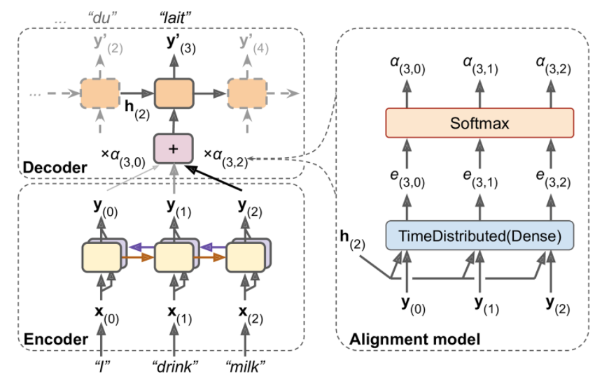
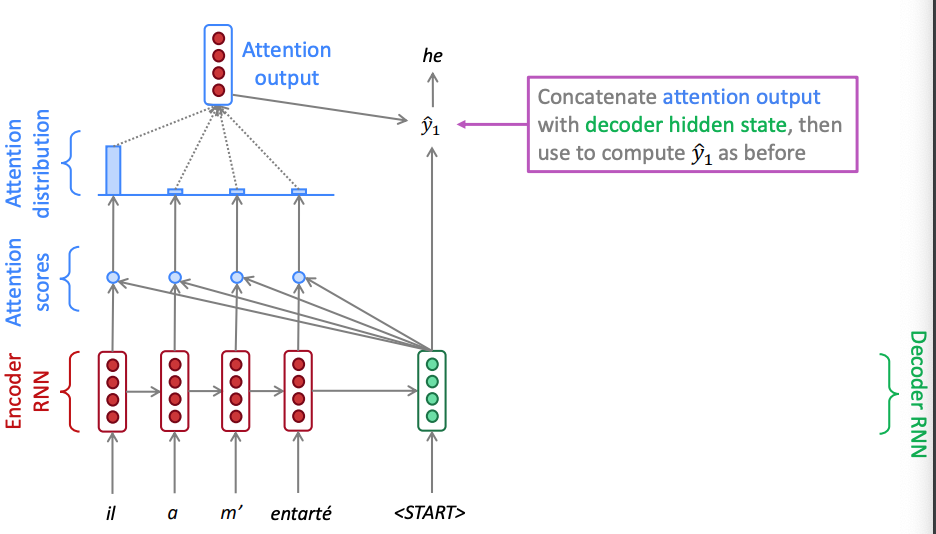
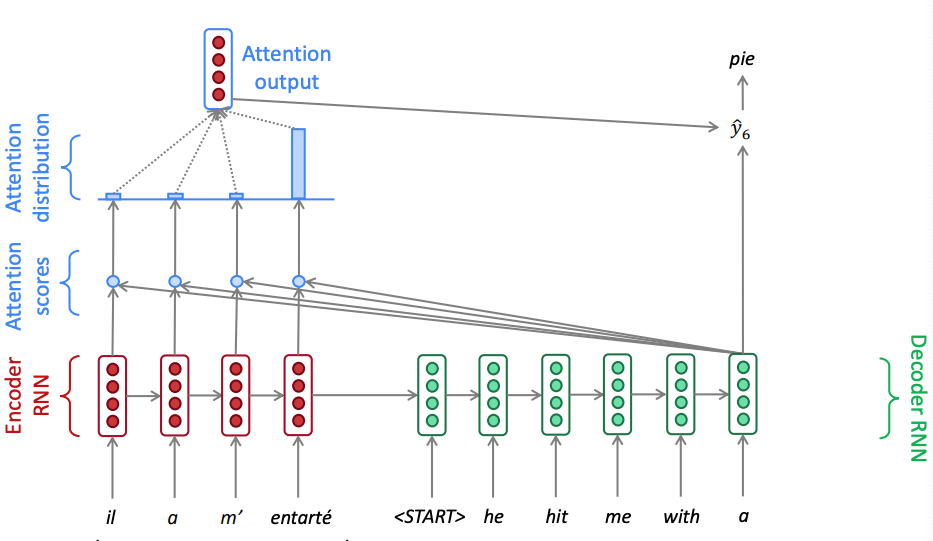

# Attention in NMT

When you hear the sentence "the soccer ball is on the field," you don’t assign the same importance to all 7 words. You primarily take note of the words "_ball_" "_on_," and "_field_" since those are the words that are most "important" to you.  

Using the _final_ RNN hidden state as _the_ single "context vector" for sequence-to-sequence models cannot differentiate between significant and less significant words. Moreover, different parts of the output may even consider different parts of the input "important." 

Attention mechanisms make use of this observation by providing the decoder network with a look at the _entire_ input sequence at every decoding step; the decoder can then decide what input words are important at any point in time. There are many types of attention mechanisms - we focus here the [archetypical method](https://arxiv.org/abs/1409.0473) that maximizes a new conditional probability that now has a **time dependency** in the context vector. 

$$p(\mathbf y | \mathbf x) = g(y_{t-1}, h_{t-1}, \phi_t)$$

To implement the above equation, we construct the following architecture with the additional capabilities:

_Attention mechanism in NMT. Instead of just sending the encoder’s final hidden state to the decoder (which is still done, although it is not shown in the figure), we now send all of its outputs to the decoder. At each time step, the decoder’s memory cell computes a weighted sum of all these encoder outputs: this determines which words it will focus on at this step. The weight $a_t(i)$ is the weight of the ith encoder output at the t-th decoder time step. For example, if the weight $α_3(2)$ is much larger than the weights $α_3(0)$ and $α_3(1)$, then the decoder will pay much more attention to word number 2 (“milk”) than to the other two words, at least at this time step._

1. During encoding the output of bidirectional LSTM encoder can provide the contextual representation of _each input word_ $x_i$ via the encoder hidden vectors $h_1, ..., h_{Tx}$ where $Tx$ is the length of the input sentence. 

2. During decoding we compute the RNN decoder hidden states $s$ using a recursive relationship,

$$s_t = g(s_{t-1}, y_{t-1}, \phi_t)$$

where $h_{t-1}$ is the previous hidden vector, $y_{t-1}$ is the generated word at the previous step and $\phi_t$ is the context vector that that captures the context from the original sentence that is relevant to the decoder at time $t$.  

The $\phi_t$ is computed with the help of a small neural network called attention layer, which is trained jointly with the rest of the Encoder–Decoder model. This alignment model is illustrated on the right hand side of the figure above. It starts with a time-distributed Dense layer with a single neuron, which receives as input all the encoder outputs, concatenated with the decoder’s previous hidden state (e.g., $\mathbf h_2$). This layer outputs a score (or energy) for each encoder output that measures how well each output is aligned with the decoder’s previous hidden state. 

1. For each hidden state from the original sentence $h_i$, $i$ is the index of the input sentence, we compute a score

$$e_{t,i} = \mathtt{attention}(s_{t−1}, h_i)$$

where $\mathtt{attention}$ is any function with values in $\mathbb R$ for instance a single layer fully-connected neural network. 

2. The score values are normalized  using a softmax layer to produce the attention vector $\mathbf α_t$.  All the weights for a given decoder time step add up to 1. 

$$\mathbf a_t = softmax(\mathbf e_{t})$$

3. The context vector $\phi_t$ is then the attention weighted average (dot product) of the hidden vectors from the original sentence. 

$$ \phi_t = \sum_i \alpha_{t,i}h_i$$

Intuitively, this vector captures the relevant contextual information from the original sentence for the t-th step of the decoder. This particular attention mechanism is called Bahdanau attention (named after the paper’s first author). Since it concatenates the encoder output with the decoder’s previous hidden state, it is sometimes called concatenative attention (or additive attention). 

The two figures below showcase what it happening in two different time instances of an example french to english translation. Notice how the attention weights calculated via the softmax that puts a lot of emphasis to the highest score vary. In time zone one the attention mechanism weighs on the pronoun and in time step 6 it weighs on the object. 

*Attention in seq2seq neural machine translation - time step 1*

*Attention in seq2seq neural machine translation - time step 6* 

