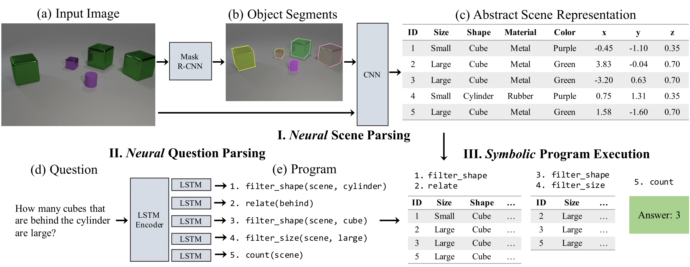

# Separating Perception and Reasoning in VQA

Purely symbolic approaches to artificial intelligence are inherently relational. Practitioners define
the relations between symbols using the language of logic and mathematics, and then reason about
these relations using a multitude of powerful methods, including deduction, arithmetic, and algebra.
But symbolic approaches suffer from the symbol grounding problem and are not robust to small
task and input variations. Other approaches, such as those based on statistical learning, build
representations from raw data and often generalize across diverse and noisy conditions. However,
a number of these approaches, such as deep learning, often struggle in data-poor problems where the
underlying structure is characterized by sparse but complex relations.

In this project you will study the implementation of AI approaches that offer the ability to combine neural and symbolic representations in their attempt to answer the so called Visual Question-Answer task. 

The first approach is based on relation networks and is considered a milestone in the development of such capability due to its simplicity and representational flexibility. The second approach is introducing object-level scene parsing and uses a program-based response system. 

## Relation Networks (by DeepMind)

In this project you will create Relation Networks that can act as plugins to state of the art video understanding systems offering not just the ability to answer questions regarding a scene but also influence the representations they generate by considering relationships between objects.   In [this seminal paper](https://arxiv.org/pdf/1706.01427.pdf) the authors present their method that can reveal relations between objects from a variety of representational formats. You can start with [this repo](https://github.com/kimhc6028/relational-networks). 

### Describe the RN (20 points)

In a tutorial fashion describe the RN approach. You can either create a lengthy markdown report (at least 2 pages) or preferably put comments inline with the code (or using markdown cells).

### Sort-of-CLEVR Dataset (50 points)

Sort-of-CLEVR is composed of 10000 images and 20 questions (10 relational questions and 10 non-relational questions) per each image. 6 colors (red, green, blue, orange, gray, yellow) are assigned to randomly chosen shape (square or circle), and placed in a image.

(25 points) Replicate the sort-of-CLEVR dataset results of the paper.  

(25 points) Perform the "state description" task and create a table that represents the state of each image as described in the end of section 3.1. You can use a sql database for persisting this information or a python data structure (eg dict) persisted in a file.  

PS: Those that have exposure to 3D world modeling tooling such as NVIDIA's Omniverse,  will appreciate the connection between the innocent "state description" table and Pixar's [Universal Scene Description (USD) markup](https://developer.nvidia.com/usd).  

## NS-VQA (by Various Institutions)

The [CLEVR dataset](https://knowyourdata-tfds.withgoogle.com/#tab=STATS&dataset=clevr) is a synthetic photorealistic 3D dataset. You will apply the [NeuroSymbolic VQA](https://arxiv.org/pdf/1810.02338.pdf) approach to it. Feel free to consult the implementation of the approach [here](https://github.com/kexinyi/ns-vqa) but you need to bring up your own repo that can demonstrate the technique (see below) with the latest versions of the frameworks of your choice. 

In all the items below, include descriptions of all impediments you will face in your attempt to replicate the results. When the paper gives you options, always select the least possible number of examples, questions etc. to ensure that the code runs in your environment. Test and obtain results only for the CLEVR dataset. 

### Scene Parser (10 points)

Thoroughly explain the operation of the scene parser - almost line by line. 

### Question Parser (10 points)

Thoroughly explain the operation of the question parser - almost line by line. 

### Program Executor (10 points)

Thoroughly explain the operation of the question parser - almost line by line. 

## Extra Credit  1 (5 points)

Usage of [Hydra for configuration **and** use Ray](https://www.anyscale.com/blog/configuring-and-scaling-ml-with-hydra-ray) to learn how to create distributed execution pipelines. 

The purpose of this extra credit is to motivate you to develop your repositories not for you but for your audience that may include future employers. Please note that distributed processing based on Ray can still be done in your laptops using the CPU cores as workers  as well as in Google Colab using even TPUs. 

## Extra Credit 2 (5 points)

Use of JAX libraries.  

## Further study

There are also newer key developments in the VQA space such as: 

J. Shi, H. Zhang, and J. Li, “Explainable and explicit visual reasoning over scene graphs,” in 2019 IEEE/CVF Conference on Computer Vision and Pattern Recognition (CVPR), Long Beach, CA, USA, Jun. 2019, doi: 10.1109/cvpr.2019.00857 [Online]. Available: https://ieeexplore.ieee.org/document/8953666/. 

You may continue the exploration after this course by studying approaches that use scene graphs such as the above. Talk to your professor if you want to pursue this. 

